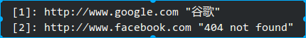

generate_ref
============

a plugin auto generate reference in sublime using markdown url dict.

###Install:

Copy to sublime plugin directory.

add this to your user key map prefrence.

    { "keys": ["ctrl+k", "ctrl+f"], "command": "generateref" } ,

### effect:

* before:

    

* select all and ctrl+k,f

    

